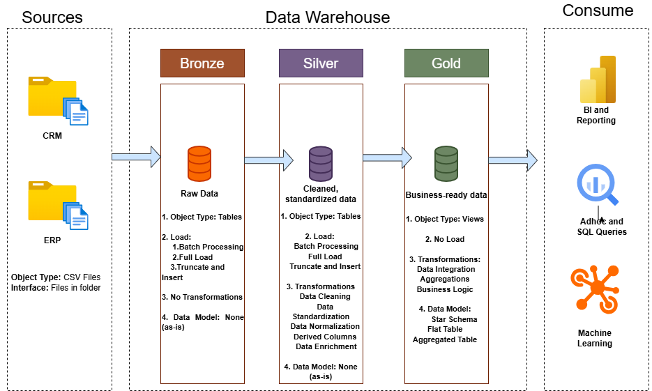

# sql-data-warehouse-project  
**Welcome to the data warehouse repository!**  
 
This project demonstrates a comprehensive warehousing solution which highlights industry best practices in data engineering and analytics.

---
### **Objective**:

Develop a modern data warehouse using SQL server to consolidate sales data, enabling analytical reporting and informed decision-making.

## Specifications:

Data Sources: Import data from two source systems(ERP and CRM) provided as CSV files.

Data Quality: Cleanse and resolve data quality issues prior to analysis.

Integration: Combine both sources into a single, user-friendly data model designed for analytical queries.

Scope: Focus on latest dataset only; historization of data is not required.

Documentation: Provide clear documentation of the data model to support both business stakeholders and analytics

** 🏗️ Design Architecture**:

## 📘 Product Documentation (Notion)
👉 [View detailed product documentation on Notion](https://www.notion.so/Data-Warehouse-Project-2c0a55a1d47880afa320c7d6bf5b7072?source=copy_link)

---
**About Me:**
Hello there! I am Anushka Phadtare. I am a Data Engineering and Analytics enthusiast. I love to create real-world, impactful projects around data!
